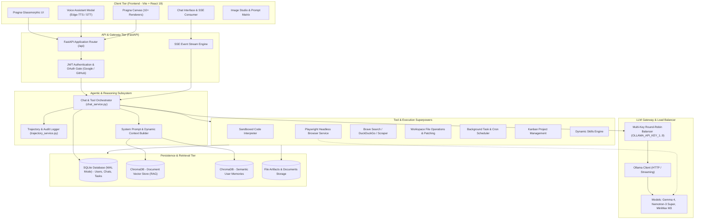
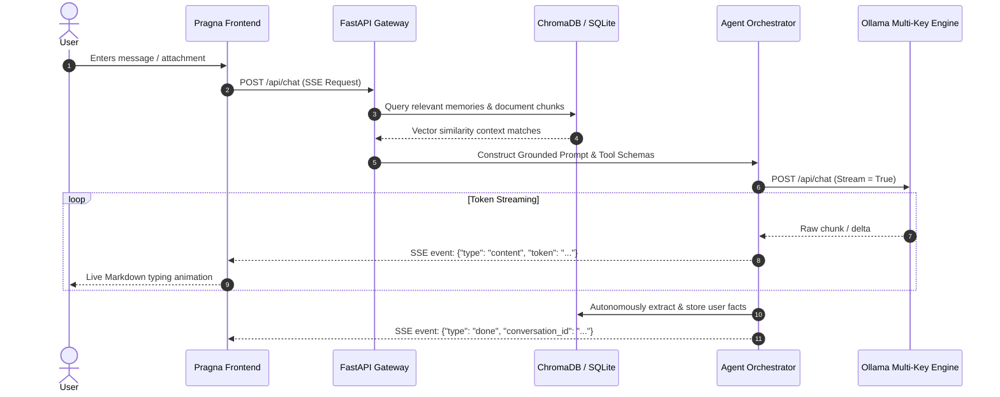
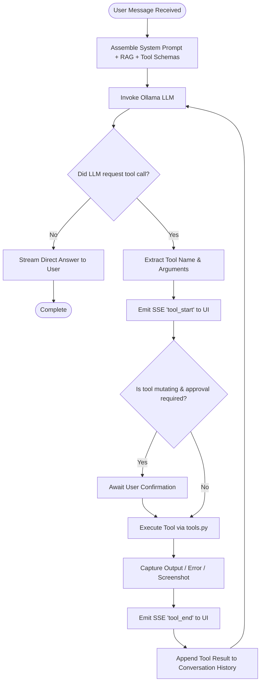
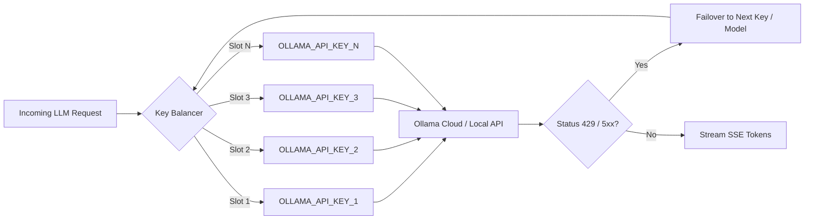

# 🤖 PRAGNA — Autonomous AI Assistant & Full-Stack Agentic Engine

<p align="center">
  <strong>Next-Generation Multimodal AI Platform with Autonomous Tool Calling, Dynamic Canvas Visualizations, Real-Time Voice, and Multi-Key LLM Load Balancing</strong>
</p>

<p align="center">
  
  
  
  
  
  
  
  
</p>

---

## 📑 Table of Contents

- [Overview](#-overview)
- [System Design & Architecture](#-system-design--architecture)
  - [High-Level Architecture Diagram](#high-level-architecture-diagram)
  - [Architectural Layers](#architectural-layers)
- [Core Workflows](#-core-workflows)
  - [1. Chat & SSE Streaming Pipeline](#1-chat--sse-streaming-pipeline)
  - [2. Autonomous Tool Calling & Execution Loop](#2-autonomous-tool-calling--execution-loop)
  - [3. Multi-Key LLM Load Balancing & Failover](#3-multi-key-llm-load-balancing--failover)
  - [4. RAG & Long-Term Memory Pipeline](#4-rag--long-term-memory-pipeline)
  - [5. Headless Browser Automation (Playwright)](#5-headless-browser-automation-playwright)
  - [6. Real-Time Voice Assistant Pipeline](#6-real-time-voice-assistant-pipeline)
  - [7. Interactive Canvas & Visual Renderers](#7-interactive-canvas--visual-renderers)
  - [8. Task Scheduling & Cron Engine](#8-task-scheduling--cron-engine)
- [Tool Catalog & Superpowers](#-tool-catalog--superpowers)
- [Project Directory Structure](#-project-directory-structure)
- [API Reference](#-api-reference)
- [Getting Started & Quickstart](#-getting-started--quickstart)
  - [Prerequisites](#prerequisites)
  - [Backend Setup](#backend-setup)
  - [Frontend Setup](#frontend-setup)
  - [Environment Configuration](#environment-configuration)
- [Security & Production Hardening](#-security--production-hardening)

---

## 🌐 Overview

**PRAGNA** is a production-grade, full-stack autonomous AI assistant designed for complex reasoning, code interpretation, web browsing, automated task execution, and interactive visual generation.

The platform couples a high-performance **FastAPI** backend with an intuitive, glassmorphic **React 19 + Vite** frontend. It integrates local and cloud inference via **Ollama**, dense vector retrieval via **ChromaDB**, headless browser automation via **Playwright**, neural text-to-speech, and an extensible tool-execution engine.

---

## 🏗 System Design & Architecture

### High-Level Architecture Diagram



---

### Architectural Layers

1. **Client Tier (`frontend/`)**:
   - Built on **React 19**, **Vite 7**, and **Tailwind CSS**.
   - Leverages **Server-Sent Events (SSE)** for zero-latency, token-by-token streaming, tool call execution feeds, and agent thinking indicators.
   - Includes the **Pragna Canvas** modal capable of rendering Architecture diagrams, Flowcharts, ER diagrams, Mindmaps, Roadmaps, Timelines, Trees, Kanban boards, and Data Charts dynamically from agent responses.

2. **API & Security Gateway (`backend/app/routes/`)**:
   - Implemented in **FastAPI** with asynchronous concurrency (`uvicorn`).
   - Token-based **JWT authentication** with bcrypt password hashing.
   - External **OAuth 2.0 integration** for Google and GitHub authentication with automatic user profile provisioning.
   - Configurable CORS whitelist for seamless cross-origin communication in development and production.

3. **Autonomous Agent Core (`backend/app/chat_service.py`)**:
   - Executes a closed-loop reasoning and action cycle: **Prompt -> Context Retrieval -> LLM Inference -> Tool Call Extraction -> Tool Execution -> Result Injection -> Final Synthesis**.
   - Preserves stateful trajectories (`trajectory_service.py`), allowing step-by-step auditing, rollback, and execution replay.
   - Enforces user safety gates on mutating tools (`write_file`, `patch`, `terminal`, browser actions) when configured.

4. **Multi-Key LLM Gateway (`backend/app/ollama_client.py`)**:
   - Built-in load-balancing engine supporting up to 9 distinct Ollama API keys (`OLLAMA_API_KEY_1` through `OLLAMA_API_KEY_9`).
   - Automatically distributes incoming streaming requests round-robin across key pools.
   - Transparent fallback cascades across top-tier models (`gemma4:cloud`, `gemma4:31b-cloud`, `nemotron-3-super:cloud`, `minimax-m3:cloud`).

5. **Memory & RAG Subsystem (`backend/app/rag.py` & `memory_service.py`)**:
   - Persistent vector embeddings via **ChromaDB** with `nomic-embed-text`.
   - Dual-vector index architecture:
     - **Document Store**: Ingests uploaded PDFs, DOCX, Markdown, and TXT files for contextual grounding.
     - **Memory Store**: Autonomously remembers user-specific preferences, facts, and constraints across sessions.

6. **Tool Execution Engine (`backend/app/tools.py`)**:
   - Sandboxed Python environment for real-time calculation, data manipulation, and visualization.
   - Full Playwright browser controller supporting navigation, clicking, typing, scrolling, screenshots, and visual inspection.
   - System terminal and workspace file manipulation capabilities.

---

## 🔄 Core Workflows

### 1. Chat & SSE Streaming Pipeline

This workflow governs how user prompts flow through context enhancement, the LLM, and back to the client as an event stream.



---

### 2. Autonomous Tool Calling & Execution Loop

When a user request requires external computation, web access, browser automation, or filesystem changes, the agent enters the tool loop.



---

### 3. Multi-Key LLM Load Balancing & Failover

To prevent API rate limits and maximize inference throughput, the Ollama client uses an active round-robin key rotator:



---

### 4. RAG & Long-Term Memory Pipeline

The platform maintains two parallel knowledge indexing workflows:

1. **Document Ingestion (RAG)**:
   - User uploads documents (`.pdf`, `.txt`, `.md`, `.docx`) via `/api/documents/upload`.
   - Documents are parsed, chunked with overlap, and vectorized using `nomic-embed-text`.
   - Embeddings are indexed in ChromaDB (`data/chroma_db`).
   - During chat, cosine similarity retrieves top-$k$ relevant chunks if score exceeds `RAG_SIMILARITY_THRESHOLD`.

2. **Autonomous Long-Term Memory**:
   - In each turn, the agent evaluates if the user stated personal preferences, credentials, tech stack choices, or system instructions.
   - `memory_service.py` extracts atomic facts and stores them in ChromaDB (`data/chroma_db/memories`).
   - In future conversations, relevant memories are proactively retrieved and injected into the prompt.

---

### 5. Headless Browser Automation (Playwright)

The integrated `browser_service.py` provides full web navigation capabilities:

- **Launch & Isolation**: Playwright runs in headless mode with dedicated browser contexts and clean profiles.
- **Actions**:
  - `browser_navigate`: Navigates to a URL and waits for network idle.
  - `browser_click`: Clicks elements using CSS selectors or coordinates.
  - `browser_type`: Fills text boxes and submits forms.
  - `browser_scroll`: Scrolls down for dynamic content loading.
  - `browser_screenshot`: Captures high-resolution visual state.
- **Vision Integration**: If the active model is vision-capable (`gemma4:cloud`, `gemma4:31b-cloud`, `minimax-m3:cloud`), the screenshot is converted to base64 and returned directly to the model's visual comprehension context.

---

### 6. Real-Time Voice Assistant Pipeline

The platform provides a low-latency bidirectional voice interaction modal:

1. **Voice Input**: The browser captures audio using the Web Audio API / MediaRecorder and streams speech audio chunks or transcribed text to `/api/voice/process`.
2. **Speech Recognition**: Transcribes spoken user prompts.
3. **Agent Synthesis**: Routes input through the agent core to generate concise, spoken-optimized responses.
4. **Neural Speech Generation**: Synthesizes the response with Microsoft **Edge-TTS** (`en-US-ChristopherNeural`, `en-US-JennyNeural`, or custom voices) and streams back MP3 audio for immediate playback.

---

### 7. Interactive Canvas & Visual Renderers

Pragna includes a dedicated **Artifacts & Canvas** system. When the model outputs structured visual data or code artifacts, the frontend automatically activates specialized renderers:

| Renderer | Visual Purpose |
| :--- | :--- |
| **ArchitectureRenderer** | Cloud infrastructure, microservice layouts, and network topologies |
| **FlowchartRenderer** | Algorithmic logic, decision trees, and operational pipelines |
| **ERDiagramRenderer** | Database schemas, entity relationships, primary/foreign keys |
| **MindmapRenderer** | Concept brainstorming, feature decomposition, and hierarchies |
| **RoadmapRenderer** | Product milestones, sprint timelines, and delivery phases |
| **KanbanRenderer** | Interactive boards with Backlog, In-Progress, and Done columns |
| **TimelineRenderer** | Historical progression and chronological event sequencing |
| **TreeRenderer** | File hierarchies, organizational charts, and AST structures |
| **ChartRenderer** | Interactive bar charts, line graphs, pie charts, and radar plots |
| **TableRenderer** | Searchable, paginated, and sortable tabular data |

---

### 8. Task Scheduling & Cron Engine

The backend includes a lightweight background task scheduler (`cron_service.py`):

- **Creation**: The agent can register recurring or scheduled jobs via the `cronjob` tool (`schedule_task`).
- **Storage**: Tasks are persisted in SQLite with cron expressions or timestamp triggers.
- **Execution**: A background worker checks for pending tasks, executes delegated prompts or scripts, and logs the execution output.

---

## 🛠 Tool Catalog & Superpowers

Pragna comes equipped with over 30 built-in agent functions:

```
├── Web & Research
│   ├── web_search            # Brave Search / DuckDuckGo live web query
│   ├── web_extract           # BeautifulSoup content extraction & markdown scraping
│   ├── x_search              # Search public X (Twitter) posts & updates
│   └── open_url              # Fetch and parse webpage content
│
├── Workspace & Files
│   ├── read_file             # Read local file contents with line range support
│   ├── write_file            # Create or overwrite project files
│   ├── patch                 # Apply unified diffs or targeted string replacements
│   └── search_files          # Pattern-based file search (fd / ripgrep equivalent)
│
├── Execution & System
│   ├── terminal              # Run shell commands in sandboxed bash
│   ├── process               # Monitor, inspect, or kill background processes
│   └── execute_code          # Run Python scripts in an isolated interpreter
│
├── Browser Automation (Playwright)
│   ├── browser_navigate      # Navigate to URL
│   ├── browser_read_page     # Extract page text, links, and structure
│   ├── browser_screenshot    # Capture page screenshot for vision model analysis
│   ├── browser_click         # Click elements via selector
│   ├── browser_type          # Input text into form controls
│   ├── browser_scroll        # Scroll viewport up/down
│   ├── browser_press         # Send keyboard key events
│   ├── browser_console       # Inspect browser console errors and logs
│   └── browser_dialog        # Handle alerts, confirms, and prompts
│
├── Memory & Context
│   ├── memory                # Store, update, or recall user facts in ChromaDB
│   └── session_search        # Semantic search across historical conversations
│
├── Automation & Planning
│   ├── todo                  # Manage structured task checklists & track progress
│   ├── delegate_task         # Spawn and orchestrate subagent tasks
│   ├── clarify               # Request user clarification when requirements are ambiguous
│   ├── cronjob               # Schedule recurring background jobs and reminders
│   ├── create_kanban_task    # Create task cards on the project Kanban board
│   ├── update_kanban_task    # Update task progress, labels, and status
│   └── list_kanban_tasks     # List all active Kanban cards
│
├── Media & Multimodal
│   ├── vision_analyze        # Analyze visual images and diagrams
│   ├── image_generate        # Generate images via Stability AI / Pollinations
│   ├── edit_image            # Transform or inpaint existing images
│   ├── video_generate        # Generate animated clips or videos
│   └── text_to_speech        # Synthesize realistic voice audio via Edge-TTS
│
└── Skills Management
    ├── skills_list           # Discover registered dynamic agent skills
    ├── skill_view            # View specific skill code and instructions
    └── skill_manage          # Create, update, or delete dynamic agent skills
```

---

## 📁 Project Directory Structure

```
pragna/
├── .gitignore                    # Root gitignore protecting secrets, venv, and builds
├── README.md                     # Comprehensive architecture and system documentation
│
├── backend/                      # FastAPI Backend Service
│   ├── .gitignore                # Backend-specific ignore rules
│   ├── .env.example              # Sample configuration file
│   ├── Dockerfile                # Production Dockerfile for backend
│   ├── requirements.txt          # Production Python dependencies
│   ├── requirements-dev.txt      # Testing and development dependencies
│   ├── pytest.ini               # Pytest configuration
│   │
│   ├── app/                      # Application Package
│   │   ├── __init__.py
│   │   ├── main.py               # FastAPI entry point, middleware, lifecycle
│   │   ├── config.py             # Pydantic Settings & environment validation
│   │   ├── db.py                 # SQLite connection pooling & WAL migrations
│   │   ├── repository.py         # Database CRUD operations
│   │   ├── auth.py               # JWT generation, verification & bcrypt hashing
│   │   ├── oauth_providers.py    # Google & GitHub OAuth client handlers
│   │   ├── ollama_client.py      # Ollama streaming client & multi-key balancer
│   │   ├── chat_service.py       # Core agent loop, SSE streamer & safety gates
│   │   ├── tools.py              # Tool schemas, implementations & executors
│   │   ├── browser_service.py    # Playwright browser controller
│   │   ├── rag.py                # ChromaDB vector store & embeddings
│   │   ├── memory_service.py     # Long-term memory vector store
│   │   ├── trajectory_service.py # Step trajectory & audit logging
│   │   ├── artifact_service.py   # Code & document artifact extraction
│   │   ├── code_interpreter.py   # Isolated Python execution runner
│   │   ├── voice_service.py      # Edge-TTS voice synthesis engine
│   │   ├── image_service.py      # Image generation & editing client
│   │   ├── kanban_service.py     # Kanban task management service
│   │   ├── cron_service.py       # Background task scheduler
│   │   ├── document_generator.py # Automated report & document generator
│   │   ├── skills_service.py     # Dynamic agent skill manager
│   │   │
│   │   └── routes/               # API Endpoint Controllers
│   │       ├── auth.py           # /api/auth (Login, register, profile)
│   │       ├── oauth.py          # /api/auth/oauth (Google, GitHub callbacks)
│   │       ├── chat.py           # /api/chat (SSE streaming chat)
│   │       ├── conversations.py  # /api/conversations (History & threads)
│   │       ├── messages.py       # /api/messages (Individual message CRUD)
│   │       ├── documents.py      # /api/documents (Upload & vector index)
│   │       ├── memories.py       # /api/memories (User memory inspection)
│   │       ├── artifacts.py      # /api/artifacts (Generated code/documents)
│   │       ├── tools.py          # /api/tools (Tool execution & status)
│   │       ├── agent.py          # /api/agent (Agent trajectories & tasks)
│   │       ├── voice.py          # /api/voice (TTS & voice endpoints)
│   │       ├── images.py         # /api/images (Image generation & gallery)
│   │       ├── system.py         # /api/system (Models, health & server info)
│   │       └── health.py         # /api/health (Liveness probes)
│   │
│   └── tests/                    # Pytest Test Suite
│       ├── test_db.py
│       ├── test_config.py
│       ├── test_tools.py
│       ├── test_branching.py
│       └── test_ollama_client.py
│
└── frontend/                     # React 19 + Vite Frontend Service
    ├── .gitignore                # Frontend-specific ignore rules
    ├── index.html                # Single Page Application HTML template
    ├── package.json              # NPM dependencies and scripts
    ├── vite.config.js            # Vite build & proxy configuration
    ├── tailwind.config.js        # Tailwind CSS theme configuration
    ├── postcss.config.js         # PostCSS plugins
    │
    ├── public/                   # Static icons, logos, and favicons
    │
    └── src/                      # Frontend Application Source
        ├── main.jsx              # Application bootstrap
        ├── App.jsx               # Root application router & view switcher
        ├── index.css             # Base styles & typography
        │
        ├── api/                  # API client modules
        ├── context/              # React Context (ChatContext, AuthContext)
        ├── hooks/                # Custom React Hooks (useAudio, useRecorder)
        ├── utils/                # Helper utilities & constants
        ├── styles/               # Component-specific CSS modules
        │
        ├── components/           # Reusable UI Components
        │   ├── auth/             # Login, Register, Neural Vortex background
        │   ├── chat/             # ChatWindow, MessageBubble, CodeBlock
        │   ├── canvas/           # PragnaCanvas and 10+ diagram renderers
        │   ├── voice/            # VoiceAssistantModal & audio visualizer
        │   ├── input/            # Prompt input, mic recorder, language select
        │   ├── layout/           # Header, Sidebar, MainLayout
        │   └── ui/               # Buttons, loaders, toggles, icon helpers
        │
        └── pragna/               # Pragna Dedicated Views & Pages
            ├── pages/            # HomePage, ComparePage, ImageStudioPage, TasksPage
            └── components/       # CommandPalette, SettingsModal, ShortcutsModal
```

---

## 🔌 API Reference

### Authentication & User Management
| Method | Endpoint | Description |
| :--- | :--- | :--- |
| `POST` | `/api/auth/register` | Create a new user account |
| `POST` | `/api/auth/login` | Authenticate and obtain a JWT bearer token |
| `GET` | `/api/auth/me` | Fetch authenticated user profile |
| `GET` | `/api/auth/oauth/google` | Initiate Google OAuth 2.0 flow |
| `GET` | `/api/auth/oauth/github` | Initiate GitHub OAuth 2.0 flow |

### Chat & Streaming
| Method | Endpoint | Description |
| :--- | :--- | :--- |
| `POST` | `/api/chat` | Main SSE streaming endpoint (receives prompt, returns token stream & tool events) |
| `GET` | `/api/conversations` | List conversation threads for current user |
| `GET` | `/api/conversations/{id}` | Fetch full message history for a conversation |
| `DELETE` | `/api/conversations/{id}` | Delete a conversation thread |

### Documents & RAG
| Method | Endpoint | Description |
| :--- | :--- | :--- |
| `POST` | `/api/documents/upload` | Upload and vectorize document (`.pdf`, `.txt`, `.docx`) |
| `GET` | `/api/documents` | List indexed documents |
| `DELETE` | `/api/documents/{id}` | Remove document and purge vectors from ChromaDB |

### Media & Voice
| Method | Endpoint | Description |
| :--- | :--- | :--- |
| `POST` | `/api/voice/tts` | Synthesize text to speech (Edge-TTS) |
| `POST` | `/api/images/generate` | Generate image via Stability AI / Pollinations |
| `GET` | `/api/images/{filename}` | Retrieve generated image asset |

### System & Health
| Method | Endpoint | Description |
| :--- | :--- | :--- |
| `GET` | `/api/health` | Service health status |
| `GET` | `/api/system/models` | List available LLMs and their tool/vision capabilities |

---

## 🚀 Getting Started & Quickstart

### Prerequisites

- **Python**: 3.11 or higher
- **Node.js**: 20.x or higher (`npm` or `pnpm`)
- **Ollama**: Local Ollama instance or an Ollama Cloud API key

---

### Backend Setup

1. Navigate to the backend directory:
   ```bash
   cd backend
   ```

2. Create a virtual environment and install dependencies:
   ```bash
   python -m venv .venv
   source .venv/bin/activate    # On Windows: .venv\Scripts\activate
   pip install -r requirements.txt
   pip install -r requirements-dev.txt
   ```

3. Install Playwright browser binaries (for browser automation tools):
   ```bash
   playwright install chromium
   ```

4. Configure your environment variables:
   ```bash
   cp .env.example .env
   ```
   *Edit `.env` to include your `JWT_SECRET` and `OLLAMA_API_KEY_1`.*

5. Launch the FastAPI development server:
   ```bash
   uvicorn app.main:app --reload --port 8000
   ```
   *The backend will be available at `http://localhost:8000` (API documentation at `http://localhost:8000/docs`).*

---

### Frontend Setup

1. Navigate to the frontend directory:
   ```bash
   cd frontend
   ```

2. Install dependencies:
   ```bash
   npm install
   ```

3. Start the Vite development server:
   ```bash
   npm run dev
   ```
   *The frontend will launch at `http://localhost:5180` (or `http://localhost:5173`).*

---

### Environment Configuration

Key settings in `backend/.env`:

| Variable | Description | Default |
| :--- | :--- | :--- |
| `OLLAMA_URL` | Ollama service endpoint | `http://localhost:11434` |
| `CHAT_MODEL` | Default model for reasoning & tools | `gemma4:cloud` |
| `EMBED_MODEL` | Embedding model for ChromaDB vectors | `nomic-embed-text` |
| `RAG_SIMILARITY_THRESHOLD` | Minimum cosine similarity score for context injection | `0.5` |
| `JWT_SECRET` | Secret key for signing user authentication tokens | *Required* |
| `OLLAMA_API_KEY_1`..`9` | Ollama Cloud API keys for round-robin load balancing | *Optional* |
| `BRAVE_SEARCH_API_KEY` | API key for Brave Search web tool | *Optional (falls back to DuckDuckGo)* |
| `STABILITY_API_KEY` | API key for Stability AI image studio | *Optional (falls back to Pollinations)* |
| `GOOGLE_CLIENT_ID` / `SECRET` | OAuth 2.0 credentials for Google sign-in | *Optional* |
| `GITHUB_CLIENT_ID` / `SECRET` | OAuth 2.0 credentials for GitHub sign-in | *Optional* |

---

## 🔒 Security & Production Hardening

- **Credential Isolation**: Secrets, tokens, and keys are loaded exclusively through environment variables and strictly excluded from version control via `.gitignore`.
- **Database Safety**: SQLite operates in WAL (Write-Ahead Logging) mode to prevent write contention and ensure data integrity during concurrent user interactions.
- **Sandboxed Execution**: Subprocess execution for shell commands and Python interpreter runs with strict timeouts to prevent resource starvation.
- **Audit Trails**: Full request trajectories, tool calls, and model outputs are tracked for observability and post-incident review.

---

## 📜 License

This project is licensed under the [MIT License](file:///home/vinay/pragna_jr_max/LICENSE).
